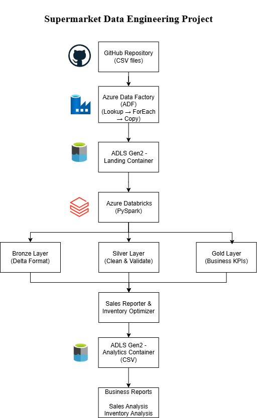
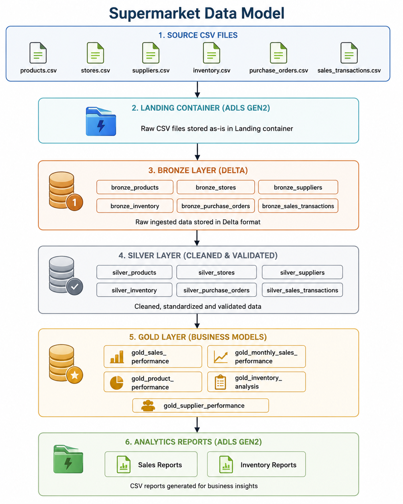
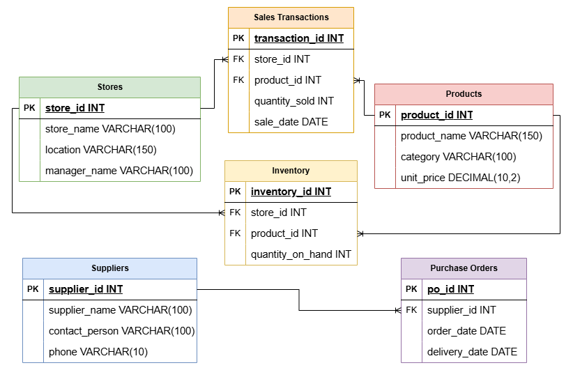
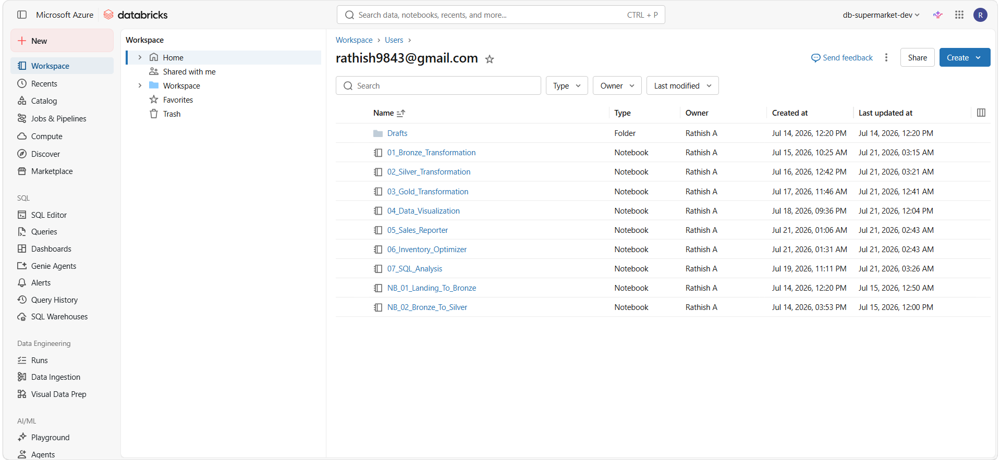

# 🛒 Supermarket Data Engineering Project

An end-to-end Azure Data Engineering solution that demonstrates metadata-driven data ingestion, transformation, and analytics using Azure Data Factory, Azure Data Lake Storage Gen2, Azure Databricks, Delta Lake, PySpark, and SQL.

---

## 📖 Project Overview

The **Supermarket Data Engineering Project** is designed to simulate a real-world cloud-based data engineering solution for a retail supermarket business.

The project ingests raw CSV files from a GitHub repository into Azure Data Lake Storage Gen2 using Azure Data Factory. Azure Databricks is then used to perform data cleansing, transformation, and business aggregations following the Medallion Architecture (Bronze, Silver, and Gold).

The Gold Layer datasets are used to generate business-ready analytical reports focused on Sales Performance and Inventory Optimization. The generated reports are stored as CSV files and can be used for reporting and business decision-making.

---

## 📑 Table of Contents

- Project Overview
- Project Objectives
- Technology Stack
- Solution Architecture
- Medallion Architecture
- Entity Relationship Diagram
- Project Structure
- Pipeline Workflow
- Business Use Cases
- Outputs
- Screenshots
- Future Enhancements
- Author

---

## 🎯 Project Objectives

- Design and implement an end-to-end Azure Data Engineering pipeline.
- Build a metadata-driven ingestion process using Azure Data Factory.
- Store raw and processed data in Azure Data Lake Storage Gen2.
- Apply the Medallion Architecture (Bronze, Silver, Gold).
- Perform data quality checks and transformations using PySpark.
- Generate business-ready Gold Layer datasets.
- Execute SQL-based business analysis.
- Produce sales performance and inventory optimization reports.
- Demonstrate best practices in cloud-based data engineering.

---
## 🛠️ Technology Stack

| Category | Technology |
|----------|------------|
| **Cloud Platform** | Microsoft Azure |
| **Data Ingestion** | Azure Data Factory (ADF) |
| **Data Storage** | Azure Data Lake Storage Gen2 (ADLS Gen2) |
| **Data Processing** | Azure Databricks |
| **Processing Engine** | Apache Spark (PySpark) |
| **Storage Format** | Delta Lake |
| **Programming Language** | Python |
| **Query Language** | SQL |
| **Development Environment** | Visual Studio Code |
| **Version Control** | Git & GitHub |

---
## 🏗️ Solution Architecture

The project follows a modern Azure Data Engineering architecture that ingests raw data, processes it through the Medallion Architecture, and generates business-ready analytical reports.

<p align="center">
    
</p>

### Workflow

1. Source CSV files are stored in the GitHub repository.
2. Azure Data Factory performs metadata-driven ingestion into the Landing container.
3. Azure Databricks reads the raw files and converts them into Delta format (Bronze Layer).
4. Silver Layer applies data cleansing, validation, and standardization.
5. Gold Layer creates business-ready datasets through aggregations and KPI calculations.
6. Analytics notebooks generate Sales and Inventory reports as CSV files.## 🏗️ Solution Architecture


## 🥉 Medallion Architecture

The project implements the Medallion Architecture to improve data quality, scalability, and analytical performance.

<p align="center">
    
</p>

### Bronze Layer
- Stores raw data in Delta format.
- Preserves the original source data.
- Acts as the historical data repository.

### Silver Layer
- Cleans and validates raw datasets.
- Removes duplicates and handles missing values.
- Standardizes formats and data types.

### Gold Layer
- Creates business-ready datasets.
- Performs aggregations and KPI calculations.
- Supports reporting and analytics.

## 🗂️ Entity Relationship Diagram

The following ER diagram illustrates the logical relationships between the core business entities used in this project.

<p align="center">
    
</p>

### Core Business Entities

- Products
- Stores
- Suppliers
- Inventory
- Purchase Orders
- Sales Transactions

These entities are connected through primary and foreign key relationships to support sales analysis, inventory management, and supplier performance reporting.

## 📂 Project Structure

```text
Supermarket-Data-Engineering-Project/
│
├── adf/
│   ├── datasets/
│   ├── linked_services/
│   └── pipelines/
│
├── data/
│   ├── Analytics/
│   ├── bronze/
│   ├── gold/
│   ├── landing/
│   ├── metadata/
│   ├── raw/
│   └── silver/
│
├── database/
│   ├── comprehensive_kpi_queries.sql
│   ├── inventory_analysis.sql
│   └── sales_analysis.sql
│
├── documentation/
│   ├── Architecture.md
│   ├── Business_Insights.md
│   ├── Data_Cleaning.md
│   ├── Data_Model.md
│   ├── Inventory_Optimization.md
│   ├── Project_Overview.md
│   ├── Sales_Performance_Analysis.md
│   └── Supermarket_Capstone_Project.docx
│
├── images/
│   ├── Azure Data Factory/
│   ├── Azure_databricks/
│   ├── Azure_resource_groups/
│   ├── datasets/
│   ├── Linked_services/
│   ├── architecture_diagram.png
│   ├── ER_diagram.png
│   └── supermarket_data_model.png
│
├── outputs/
│   ├── reports/
│   └── visualizations/
│
├── scripts/
│   ├── notebooks/
│   │   ├── 01_Bronze_Transformation.py
│   │   ├── 02_Silver_Transformation.py
│   │   ├── 03_Gold_Transformation.py
│   │   └── 04_Data_Visualization.py
│   │
│   ├── py_scripts/
│   │   ├── 05_Sales_Reporter.py
│   │   └── 06_Inventory_Optimizer.py
│   │
│   └── generate_sample_data.py
│
├── .gitignore
└── README.md
```

## 🔄 Pipeline Workflow

The project follows a modern Azure Data Engineering workflow to transform raw supermarket data into business-ready analytical datasets.

### Step 1 – Source Data

- Raw supermarket datasets are stored as CSV files in a GitHub repository.
- A metadata JSON file controls the ingestion process.

### Step 2 – Data Ingestion

Azure Data Factory performs metadata-driven ingestion using:

- Lookup Activity
- ForEach Activity
- Parameterized Datasets
- Copy Activity

The raw CSV files are copied into the **Landing** container of Azure Data Lake Storage Gen2.

### Step 3 – Bronze Layer

Azure Databricks reads the Landing data and:

- Converts CSV files into Delta format
- Preserves raw data
- Stores Delta tables in the Bronze layer

### Step 4 – Silver Layer

Data quality transformations include:

- Duplicate removal
- Missing value handling
- Invalid data correction
- Data type standardization
- Business rule validation

### Step 5 – Gold Layer

Business-ready datasets are created using aggregations and KPI calculations, including:

- Sales Performance
- Monthly Sales Performance
- Product Performance
- Inventory Analysis
- Supplier Performance

### Step 6 – Analytics Reporting

Dedicated analytics notebooks generate:

- Sales Performance Reports
- Inventory Optimization Reports
- Business KPI Reports

The reports are exported as CSV files to the Analytics container.

## ⭐ Key Features

- Metadata-driven data ingestion using Azure Data Factory
- End-to-end Medallion Architecture (Bronze, Silver, Gold)
- Delta Lake implementation for scalable storage
- PySpark-based data transformation
- Data quality validation and cleansing
- SQL-based business analytics
- Sales performance reporting
- Inventory optimization reporting
- Visualization of business KPIs
- Modular and reusable notebook design

## 💼 Business Use Cases

This project demonstrates how modern data engineering can support business decision-making in the retail supermarket industry.

### 📈 Sales Performance Analysis
- Identify top-performing stores based on revenue.
- Analyze monthly sales trends.
- Determine best-selling products.
- Monitor product-wise revenue and sales quantity.
- Compare store performance across different locations.

### 📦 Inventory Optimization
- Identify low-stock and out-of-stock products.
- Detect overstocked inventory.
- Analyze inventory turnover.
- Improve replenishment planning.
- Monitor inventory levels across stores.

### 🚚 Supplier Performance
- Evaluate supplier delivery performance.
- Measure average delivery times.
- Compare supplier reliability.
- Support procurement decision-making.

---

## 📊 Project Outputs

The project generates business-ready datasets and analytical reports.

### Gold Layer Datasets

- Sales Performance
- Monthly Sales Performance
- Product Performance
- Inventory Analysis
- Supplier Performance

### Generated Reports

#### 📈 Sales Reports

- Sales Performance Summary
- Top Store Performance
- Monthly Sales Trend
- Product Sales Summary
- Top Revenue Products
- Market Share Analysis
- Product Diversity Report

#### 📦 Inventory Reports

- Low Stock Report
- Inventory Velocity Report
- Overstock Analysis
- Inventory Replenishment Report
- Supplier Delivery Performance
- Supplier Performance Scorecard
- Supplier Reliability Analysis

---

## 📸 Project Screenshots

### Azure Data Factory

<p align="center">
  
</p>

### Azure Databricks

<p align="center">
  
</p>

### Azure Resource Group

<p align="center">
  
</p>

---

## 🚀 Future Enhancements

- Implement real-time data ingestion using Azure Event Hubs or Kafka.
- Automate pipeline execution with scheduled triggers.
- Integrate Azure Synapse Analytics for advanced querying.
- Build interactive dashboards using Power BI.
- Add CI/CD deployment using Azure DevOps or GitHub Actions.
- Enhance data quality monitoring and alerting.

---

## 👨‍💻 Author

**Rathish A**

Azure Data Engineering Capstone Project

GitHub: https://github.com/Rathish07a

---